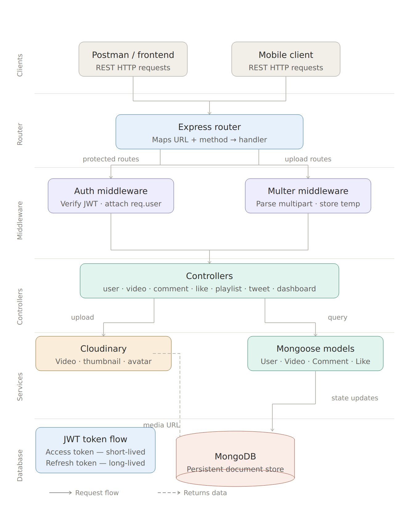

# 🎬 YouTube Backend API

> A scalable, production-ready REST API backend for a YouTube-like video platform — featuring authentication, media handling, social interactions, and analytics.

[](https://nodejs.org)
[](https://expressjs.com)
[](https://mongodb.com)
[](https://jwt.io)
[](https://cloudinary.com)
[](LICENSE)

---

## 📌 Table of Contents

- [Project Overview](#-project-overview)
- [Tech Stack](#%EF%B8%8F-tech-stack)
- [Features](#-features)
- [System Architecture](#-system-architecture)
- [Request Lifecycle](#-request-lifecycle)
- [Authentication Flow](#-authentication-flow)
- [Project Structure](#-project-structure)
- [API Endpoints](#-api-endpoints)
- [Environment Variables](#-environment-variables)
- [Installation & Setup](#%EF%B8%8F-installation--setup)
- [Learning Outcomes](#-learning-outcomes)
- [Contributing](#-contributing)
- [Author](#-author)

---

## 🚀 Project Overview

This backend powers a full-featured video-sharing platform similar to YouTube. It exposes clean RESTful APIs for user management, video publishing, comments, likes, subscriptions, playlists, tweets, and channel analytics.

Built with industry-standard patterns including JWT-based auth, refresh token rotation, Cloudinary media storage, and MongoDB aggregation pipelines.

---

## ⚙️ Tech Stack

| Layer | Technology | Purpose |
|-------|-----------|---------|
| Runtime | Node.js | JavaScript server environment |
| Framework | Express.js | HTTP routing and middleware |
| Database | MongoDB + Mongoose | Persistent storage and schema modeling |
| Authentication | JWT + bcrypt | Secure login and password hashing |
| File Upload | Multer | Handling multipart form data |
| Media Storage | Cloudinary | Video, thumbnail, and avatar hosting |
| Config | dotenv | Environment variable management |
| HTTP Utilities | cookie-parser, cors | Cookie and cross-origin handling |

---

## ✨ Features

### 👤 User Management
- Registration and login with hashed passwords
- JWT-based authentication (Access + Refresh tokens)
- Avatar and cover image upload via Cloudinary
- Profile updates and watch history tracking

### 🎥 Video Management
- Upload and publish videos with thumbnails
- Edit title, description, and visibility
- Soft delete and permanent removal
- Search, filter, sort with pagination

### 💬 Comment System
- Add, edit, and delete comments on videos
- Nested reply support
- User-linked comment threads

### 👍 Like System
- Toggle like/unlike on videos, comments, and tweets
- Fetch all liked content for the current user

### 📢 Subscription System
- Subscribe and unsubscribe from channels
- View full subscriber list and subscriptions
- Power channel growth and dashboard stats

### 📂 Playlist Management
- Create, update, and delete playlists
- Add and remove videos dynamically
- Public/private playlist support

### 🐦 Tweet Feature
- Post short updates from your channel
- Like, edit, and delete tweets
- View all tweets per user

### 📊 Dashboard & Analytics
- Total video views, likes, and subscriber count
- Channel-level stats via MongoDB aggregation
- Overview of uploaded videos

### 🏥 Health Check
- Simple `/healthcheck` endpoint to verify server and DB status

---

## 🏗️ System Architecture

The project follows a clean **layered, request-driven** architecture across independently scoped responsibilities:

<p align="center">
  
</p>

**Architecture tiers:**

| Tier | Component | Responsibility |
|------|-----------|----------------|
| 0 | Client | Sends HTTP requests (Postman, browser, mobile) |
| 1 | Express Router | Matches URL + method → routes to correct handler |
| 2 | Middleware | Auth (JWT verify) and Multer (file parsing) run before controllers |
| 3 | Controllers | Business logic — validates, orchestrates, responds |
| 4 | Services | Cloudinary (media) and Mongoose (DB queries) |
| 5 | MongoDB | Persistent document storage |

---

## 🔁 Request Lifecycle

A complete trace of a **video upload** request:

```
POST /api/v1/videos/upload
        │
        ▼
  Multer Middleware          ← Intercepts multipart data, stores file temporarily
        │
        ▼
  Auth Middleware            ← Verifies JWT, attaches req.user to request
        │
        ▼
  uploadVideo Controller     ← Validates inputs, orchestrates upload
        │
        ▼
  Cloudinary Upload          ← Streams temp file, gets back public URL
        │
        ▼
  Video.create() (Mongoose)  ← Saves document with URL, owner, metadata
        │
        ▼
  JSON Response              ← Returns 201 with video data to client
```

---

## 🔐 Authentication Flow

This project uses a **dual-token JWT system** — industry-standard and secure.

```
1. Client sends POST /api/v1/users/login
   { email, password }

2. Server:
   ├─ Finds user in MongoDB by email
   ├─ Compares password using bcrypt.compare()
   └─ On success → generates:
       ├─ Access Token  (short-lived, e.g. 1 day)
       └─ Refresh Token (long-lived, e.g. 10 days, stored in DB)

3. Tokens sent to client via:
   ├─ HttpOnly cookies (secure)
   └─ Response body (for API clients)

4. On future requests:
   └─ Auth Middleware extracts token → verifies → attaches req.user

5. When access token expires:
   └─ Client calls POST /api/v1/users/refresh-token
       └─ Server validates refresh token → issues new access token
```

> This pattern keeps sessions secure, stateless, and scalable.

---

## 📁 Project Structure

```
youtube_backend/
│
├── src/
│   ├── controllers/       ← Route handler logic (one file per resource)
│   │   ├── user.controller.js
│   │   ├── video.controller.js
│   │   ├── comment.controller.js
│   │   ├── like.controller.js
│   │   ├── subscription.controller.js
│   │   ├── playlist.controller.js
│   │   ├── tweet.controller.js
│   │   └── dashboard.controller.js
│   │
│   ├── models/            ← Mongoose schemas
│   │   ├── user.model.js
│   │   ├── video.model.js
│   │   ├── comment.model.js
│   │   ├── like.model.js
│   │   ├── subscription.model.js
│   │   ├── playlist.model.js
│   │   └── tweet.model.js
│   │
│   ├── routes/            ← Express routers
│   ├── middlewares/       ← auth.middleware.js, multer.middleware.js
│   ├── utils/             ← ApiError, ApiResponse, asyncHandler, cloudinary
│   └── app.js             ← Express app setup
│
├── public/                ← Temp file storage (Multer)
├── docs/                  ← Architecture diagram and assets
├── .env.sample            ← Environment variable template
├── package.json
└── README.md
```

---

## 📡 API Endpoints

### Auth & Users
| Method | Endpoint | Description | Auth |
|--------|----------|-------------|------|
| `POST` | `/api/v1/users/register` | Register a new user | ❌ |
| `POST` | `/api/v1/users/login` | Login and receive tokens | ❌ |
| `POST` | `/api/v1/users/logout` | Logout and clear tokens | ✅ |
| `POST` | `/api/v1/users/refresh-token` | Renew access token | ❌ |
| `GET` | `/api/v1/users/current-user` | Get logged-in user profile | ✅ |
| `PATCH` | `/api/v1/users/update-account` | Update name/email | ✅ |
| `PATCH` | `/api/v1/users/avatar` | Update avatar image | ✅ |
| `GET` | `/api/v1/users/c/:username` | Get channel profile | ✅ |
| `GET` | `/api/v1/users/history` | Get watch history | ✅ |

### Videos
| Method | Endpoint | Description | Auth |
|--------|----------|-------------|------|
| `GET` | `/api/v1/videos` | Get all videos (search, paginate) | ✅ |
| `POST` | `/api/v1/videos` | Upload a new video | ✅ |
| `GET` | `/api/v1/videos/:videoId` | Get single video by ID | ✅ |
| `PATCH` | `/api/v1/videos/:videoId` | Update video details | ✅ |
| `DELETE` | `/api/v1/videos/:videoId` | Delete a video | ✅ |
| `PATCH` | `/api/v1/videos/toggle/:videoId` | Toggle publish status | ✅ |

### Comments
| Method | Endpoint | Description | Auth |
|--------|----------|-------------|------|
| `GET` | `/api/v1/comments/:videoId` | Get all comments for a video | ✅ |
| `POST` | `/api/v1/comments/:videoId` | Add a comment | ✅ |
| `PATCH` | `/api/v1/comments/c/:commentId` | Edit a comment | ✅ |
| `DELETE` | `/api/v1/comments/c/:commentId` | Delete a comment | ✅ |

### Likes
| Method | Endpoint | Description | Auth |
|--------|----------|-------------|------|
| `POST` | `/api/v1/likes/toggle/v/:videoId` | Toggle like on video | ✅ |
| `POST` | `/api/v1/likes/toggle/c/:commentId` | Toggle like on comment | ✅ |
| `POST` | `/api/v1/likes/toggle/t/:tweetId` | Toggle like on tweet | ✅ |
| `GET` | `/api/v1/likes/videos` | Get all liked videos | ✅ |

### Subscriptions
| Method | Endpoint | Description | Auth |
|--------|----------|-------------|------|
| `POST` | `/api/v1/subscriptions/c/:channelId` | Toggle subscribe/unsubscribe | ✅ |
| `GET` | `/api/v1/subscriptions/c/:channelId` | Get channel subscribers | ✅ |
| `GET` | `/api/v1/subscriptions/u/:subscriberId` | Get subscribed channels | ✅ |

### Playlists
| Method | Endpoint | Description | Auth |
|--------|----------|-------------|------|
| `POST` | `/api/v1/playlists` | Create a playlist | ✅ |
| `GET` | `/api/v1/playlists/:playlistId` | Get playlist by ID | ✅ |
| `PATCH` | `/api/v1/playlists/:playlistId` | Update playlist | ✅ |
| `DELETE` | `/api/v1/playlists/:playlistId` | Delete playlist | ✅ |
| `PATCH` | `/api/v1/playlists/add/:videoId/:playlistId` | Add video to playlist | ✅ |
| `PATCH` | `/api/v1/playlists/remove/:videoId/:playlistId` | Remove video | ✅ |
| `GET` | `/api/v1/playlists/user/:userId` | Get user's playlists | ✅ |

### Tweets
| Method | Endpoint | Description | Auth |
|--------|----------|-------------|------|
| `POST` | `/api/v1/tweets` | Create a tweet | ✅ |
| `GET` | `/api/v1/tweets/user/:userId` | Get user's tweets | ✅ |
| `PATCH` | `/api/v1/tweets/:tweetId` | Update a tweet | ✅ |
| `DELETE` | `/api/v1/tweets/:tweetId` | Delete a tweet | ✅ |

### Dashboard & Health
| Method | Endpoint | Description | Auth |
|--------|----------|-------------|------|
| `GET` | `/api/v1/dashboard/stats` | Get channel statistics | ✅ |
| `GET` | `/api/v1/dashboard/videos` | Get channel videos | ✅ |
| `GET` | `/api/v1/healthcheck` | Server health status | ❌ |

---

## 🔒 Environment Variables

Create a `.env` file in the project root. Use `.env.sample` as reference:

```env
# Server
PORT=8000
CORS_ORIGIN=*

# MongoDB
MONGODB_URI=mongodb+srv://<username>:<password>@cluster.mongodb.net

# JWT Secrets
ACCESS_TOKEN_SECRET=your_access_token_secret_here
ACCESS_TOKEN_EXPIRY=1d
REFRESH_TOKEN_SECRET=your_refresh_token_secret_here
REFRESH_TOKEN_EXPIRY=10d

# Cloudinary
CLOUDINARY_CLOUD_NAME=your_cloud_name
CLOUDINARY_API_KEY=your_api_key
CLOUDINARY_API_SECRET=your_api_secret
```

> ⚠️ Never commit your `.env` file. It is already listed in `.gitignore`.

---

## 🛠️ Installation & Setup

### Prerequisites
- Node.js v18+
- MongoDB Atlas account (or local MongoDB)
- Cloudinary account

### Steps

**1. Clone the repository**
```bash
git clone https://github.com/iamanu26/youtube_backend.git
cd youtube_backend
```

**2. Install dependencies**
```bash
npm install
```

**3. Configure environment variables**
```bash
cp .env.sample .env
# Fill in your values in .env
```

**4. Start the development server**
```bash
npm run dev
```

Server runs at: `http://localhost:8000`

**5. Test the health check**
```bash
curl http://localhost:8000/api/v1/healthcheck
```

---

## 🧠 Learning Outcomes

Building this project covers a strong foundation of backend engineering:

- **REST API design** — clean, consistent endpoint structure
- **JWT authentication** — access/refresh token lifecycle and rotation
- **Password security** — bcrypt hashing, never storing plaintext
- **File handling** — Multer for uploads, Cloudinary for persistent storage
- **MongoDB schema design** — normalized vs embedded tradeoffs
- **Aggregation pipelines** — for dashboard stats, watch history, channel data
- **Middleware patterns** — reusable auth, error handling, async wrappers
- **Scalable architecture** — modular separation of concerns

---

## 🤝 Contributing

Contributions are welcome! Here's how:

1. Fork the repository
2. Create a feature branch: `git checkout -b feature/your-feature-name`
3. Commit your changes: `git commit -m 'Add: your feature description'`
4. Push to the branch: `git push origin feature/your-feature-name`
5. Open a Pull Request

Please follow existing code style and add comments where needed.

---

## 📜 License

This project is licensed under the [MIT License](LICENSE).

---

## 👨‍💻 Author

**Anurag Dubey**

- GitHub: [@iamanu26](https://github.com/iamanu26)

---

## ⭐ Show Your Support

If this project helped you learn or inspired your own backend:

- ⭐ **Star** the repo
- 🍴 **Fork** it and build on top
- 📢 **Share** it with others learning backend development

---

*Built with ❤️ using Node.js, Express, and MongoDB*
